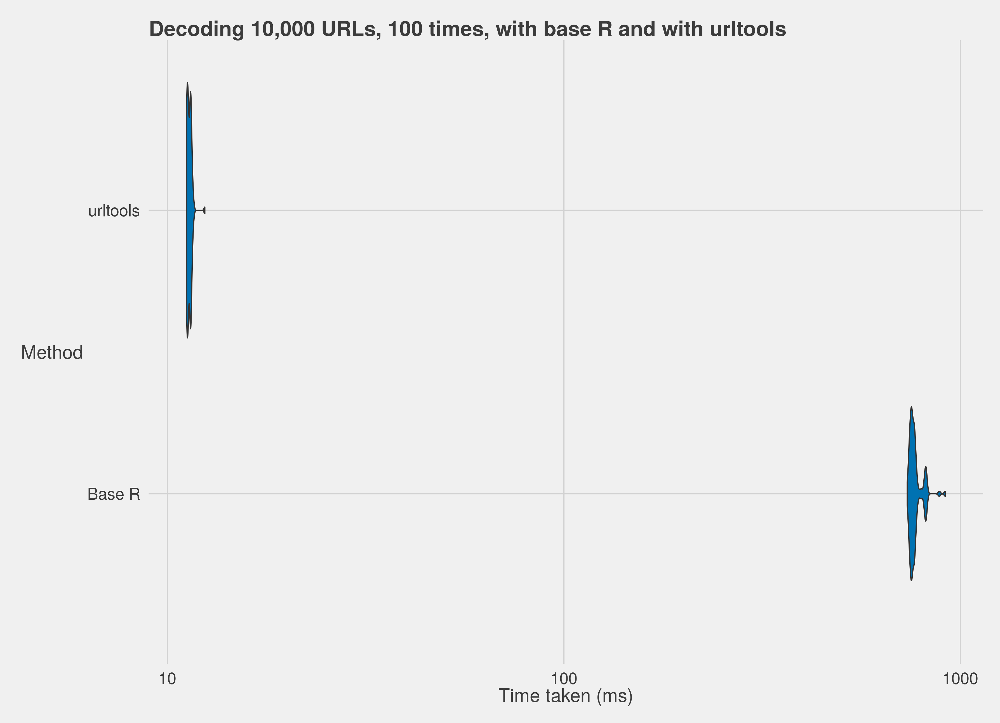

## Who?

1. Oliver Keyes. Hi!
2. HCI researcher, R programmer and speed nerd.
3. R Cat Lady

## What?

1. URLs are more than just conduits to data - they can be data too!
2. Access logs, web data, clicktracking data
3. Base R doesn't do well with lots of URLs

## Use cases

* Web data analysis - access logs have URLs. Lots of them.
* These URLs are sometimes decoded. Or encoded. Or broken. Or argh.

## Mo URLs, Mo Problems

```{r, eval=FALSE}
urls <- c("http://R.url.handlers/",
          "http://are.scalar.what")
URLdecode(urls)

[1] "http://R.url.handlers/"
Warning message:
In charToRaw(URL) : argument should be a character
vector of length 1 all but the first element will
be ignored
```

## Encoding...doesn't work

```{r}
urls <- "http://fine.scalar.sigh.whatever/"
URLencode(urls, reserved = TRUE)
```

## Decoding...doesn't work

```{r, eval = FALSE}
urls <- "http://what.about.decoding/test%gIL"
URLdecode(urls)

Error in rawToChar(out) : embedded nul in string:
'http://what.about.decoding/test\0L'
In addition: Warning message:
In URLdecode(urls) : out-of-range values treated
as 0 in coercion to raw
```

## Introducing urltools!

1. Vectorised
2. C++-backed
3. Features coming out of its ears

## Encoding and decoding
```{r}

library(urltools)

url <- "http://does%20this%20work/%gIL"
url_decode(url)

url <- "http://awesome what about this/"
url_encode(url)

urls <- c("http://thats%20really%20cool/",
          "http://look%20at%20it%20go/")
url_decode(urls)
```

## Parsing and composing
```{r}

library(magrittr)

url <- "http://user2015.math.aau.dk/invited_talks#francois"

str(url_parse(url))

url_parse(url) %>% url_compose
```

## Getting and setting
```{r}

url <- "http://everythingiknowilearnedfromlubridate.org/page"

scheme(url)

domain(url)

scheme(url) <- "https"
domain(url) <- "isbetter.org"
url
```

## Parameter extraction

```{r}

url <- "http://thisisaurl/withapath/?action=query&date=20150530&authorised=true"

str(url_parameters(url, c("date", "authorised")))
```

## Benchmarks



## Benchmarks

* 70x faster than base R
* 4x faster than Python
* 1m URLs decoded in 0.9 seconds
* 1m URLs parsed in 1.3 seconds

## Fin.

> install.packages("urltools")

> http://github.com/Ironholds/urltools

> http://ironholds.org

Questions?
